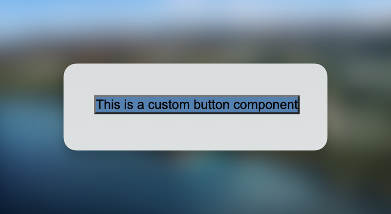

# Component Library Library

The goal of this repo is to showcase different setups that allow you to share React components between repositories.

## Motivation

In most corporate landscapes you have multiple UIs that live in different repositories. In order to avoid duplication and improve consistency, common components such as buttons and dialogs should be shared across those repositories.

## Setup

In order to not overcomplicate things unnecessarily, each sharing setup will have one library (that houses the components to be shared) and one simple Next.js app (that consumes the shared components).

We will also set up all libraries as [ES Modules](https://nodejs.org/api/esm.html#introduction). All libraries (with exception of the barebones example) will be written in [TypeScript](https://www.typescriptlang.org/). We are going to use [`pnpm`](https://pnpm.io/) as a package manager (but everything will work with `npm` or `yarn` just fine).

## [Level 1: Barebones](./lib/bare)

> Setup: React

While I would not recommend doing this, you can use React completely without a build step. Doing so results in the absolute most minimal setup possible.

**Create a `package.json`**

First, create a `package.json` file:

```json
{
  "name": "@ccl/lib-bare",
  "main": "./index.js",
  "type": "module"
}
```

- `name` ([Reference](https://nodejs.org/api/packages.html#name)): This is the name of your library that users will use to import it. Here, one would import a component like this: `import { Button } from '@ccl/lib-bare`.
- `main` ([Reference](https://nodejs.org/api/packages.html#main)): All things exported from the file referenced here will be available to import. Here, `index.js` needs to contain `export const Button = ...` so that we can do `import { Button } from '@ccl/lib-bare`.
- `type` ([Reference](https://nodejs.org/api/packages.html#type)): This tells the importing application what type of JavaScript module to expect. We want to build our libraries as ES Modules, so we set it to `"module"`.

**Add `react`**

As we're not going to have a build step for this library, properly setting up React as a dependency doesn't really matter and will be covered in a later setup. For now, we'll just do `pnpm add react`.

**Create a component**

Normally, you would create a React component like this:


```jsx
export const Button = () => (
  <button style={{ backgroundColor: 'steelblue' }}>
    {children}
  </button>
)
```

For this to work we would need a build step - JSX syntax is not vanilla JavaScript. Instead, our component will look like this:


```js
export const Button = ({ children }) => React.createElement('button', {
  style: { backgroundColor: 'steelblue' }
}, children)
```

For more information on the `createElement` method feel free to head over to the [React docs](https://react.dev/reference/react/createElement).

**Publish it**

This repo uses a PNPM workspace setup, so we don't need to publish the packages here. Outside of a monorepo, you would use [npm publish](https://docs.npmjs.com/cli/commands/npm-publish) or some wrapper around it (like [np](https://github.com/sindresorhus/np)) for this.

**Consume it**

Within an app, you can now use the button component by importing it like this:


```js
import { Button } from '@cll/lib-bare'
```


<figcaption style="text-align:center;font-size:.75rem;opacity:80%">Our ugly button within our demo app!</figcaption>