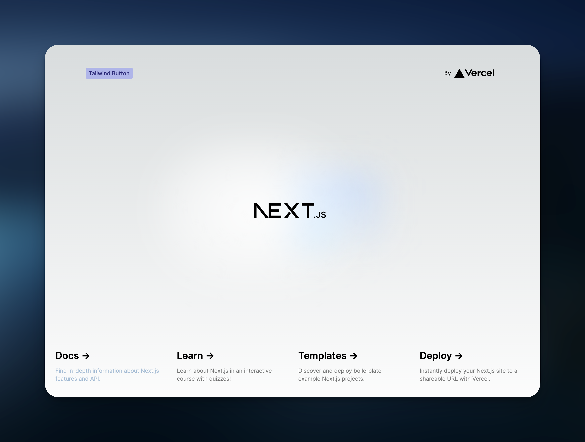

# Component Library Library

The goal of this repo is to showcase different setups that allow you to share React components between repositories.

## Motivation

In most corporate landscapes you have multiple UIs that live in different repositories. In order to avoid duplication and improve consistency, common components such as buttons and dialogs should be shared across those repositories.

## Available library setups

Currently the following setups are available - each one builds up on the previous one.

- [**bare**](#level-1-barebones) - absolute bare minimum required to share a React component, doesn't even use JSX.
- [**bare-ts**](#level-2-barebones-typescript) - simplest TypeScript setup possible.
- [**bare-ts-tooling**](#level-3-bare-bones-typescript-with-tooling) - same as `bare-ts`, but with ESLint, tsup and a GitHub Action.
- [**css**](#level-4-css) - adds global and component styling to `bare-ts-tooling`.
- [**tailwind**](#level-5-tailwind) - adds [TailwindCSS](https://tailwindcss.com/) to `css`.

## Setup

In order to not over-complicate things unnecessarily, each sharing setup will have one library (that houses the components to be shared) and one simple Next.js app (that consumes the shared components).

We will also set up all libraries as [ES Modules](https://nodejs.org/api/esm.html#introduction). All libraries (with exception of the bare-bones example) will be written in [TypeScript](https://www.typescriptlang.org/). We are going to use [`pnpm`](https://pnpm.io/) as a package manager (but everything will work with `npm` or `yarn` just fine).

To run a specific library locally,

1. clone the repo,
2. `pnpm install` at the root,
3. `pnpm build` in the library of your choice,
4. `pnpm dev` in its consuming application.

## Core Concepts

All libraries are intended to be used in React applications that have some kind of proper build step. That means that you will not be able to do old-school shenanigans like sourcing it directly via a `script` tag in some hand-written HTML.

This makes our lives as library authors way more comfortable:

- We do not minify our library. The application that consumes the library does.
- We do not bundle dependencies (with exceptions, as always). The application's bundling step resolves dependencies transitively.
- We do not polyfill for random old browsers. The application's bundling step does so if necessary.

## [Level 1: Barebones](./lib/bare/)

> **Note**
>
> Summary: Absolute bare minimum necessary to share a React component.

While I would not recommend doing this, you can use React completely without a build step. Doing so results in the absolute most minimal setup possible.

**Create a `package.json`**

First, create a `package.json` file:

```json
{
  "name": "@ccl/lib-bare",
  "main": "./index.js",
  "type": "module"
}
```

*   `name` ([Reference](https://nodejs.org/api/packages.html#name)): This is the name of your library that users will use to import it. Here, one would import a component like this: `import { Button } from '@ccl/lib-bare`.
*   `main` ([Reference](https://nodejs.org/api/packages.html#main)): All things exported from the file referenced here will be available to import. Here, `index.js` needs to contain `export const Button = ...` so that we can do `import { Button } from '@ccl/lib-bare`.
*   `type` ([Reference](https://nodejs.org/api/packages.html#type)): This tells the importing application what type of JavaScript module to expect. We want to build our libraries as ES Modules, so we set it to `"module"`.

**Add `react`**

As we're not going to have a build step for this library, properly setting up React as a dependency doesn't really matter and will be covered in a later setup. For now, we'll just do `pnpm add react`.

**Create a component**

Normally, you would create a React component like this:

```jsx
export const Button = () => (
  <button style={{ backgroundColor: 'steelblue' }}>
    {children}
  </button>
)
```

For this to work we would need a build step - JSX syntax is not vanilla JavaScript. Instead, our component will look like this:

```js
import { createElement } from 'react'

export const Button = ({ children }) => createElement('button', {
  style: { backgroundColor: 'steelblue' }
}, children)
```

For more information on the `createElement` method feel free to head over to the [React docs](https://react.dev/reference/react/createElement).

**Publish it**

This repo uses a PNPM workspace setup, so we don't need to publish the packages here. Outside of a monorepo, you would use [npm publish](https://docs.npmjs.com/cli/commands/npm-publish) or some wrapper around it (like [np](https://github.com/sindresorhus/np)) for this.

**Consume it**

Within an app, you can now use the button component by importing it like this:

```js
import { Button } from '@cll/lib-bare'
```


<figcaption>Our ugly button within our demo app!</figcaption>

## [Level 2: Barebones TypeScript](./lib/bare-ts/)

> **Note**
>
> Summary: Bare minimum required for sharing a React component written in TypeScript.

Nobody wants to write React without JSX. As we're going to need a build step anyway and there's no sane reason to build something without TypeScript nowadays, we're going to go directly to JSX + TypeScript.

Starting from the Level 1 code, we

- move the `index.js` to `src/index.tsx` (to better separate code and build artefact later), and
- add `typescript` and React's types to our `devDependencies` (see the [Appendix](#dependency-types) for an overview over the different dependency types): `pnpm add -D typescript @types/react`.

Once we set up a build step, the built library will be exposed in `dist/index.js` together with a declaration file at `dist/index.d.ts`, so we update the `package.json` accordingly:

```json
{
  "main": "dist/index.js",
  "types": "dist/index.d.ts"
}
```

**Setting up TypeScript**

In order to compile TypeScript + JSX to vanilla JavaScript, we will add a `build` script to our `package.json` that runs the TypeScript compiler (we will use fancier tooling like `esbuild` in the future):

```json
{
  "scripts": {
    "build": "tsc"
  }
}
```

By default, the TypeScript compiler doesn't really know what to do with your stuff, so you need to create a `tsconfig.json`:

```json
{
  "include": ["src"],
  "compilerOptions": {
    "target": "ESNext",
    "moduleResolution": "nodenext",
    "outDir": "dist",
    "jsx": "react-jsx"
  }
}
```

- `include` ([Reference](https://www.typescriptlang.org/tsconfig#include)): This tells TypeScript which files to look at.
- `compilerOptions.target` ([Reference](https://www.typescriptlang.org/tsconfig#target)): This tells TypeScript which version of ECMAScript (aka which JavaScript standard) to compile to. When developing apps, this should be set to something sensible like `ES6`. For libraries like here, we want the consuming application to have full control over its own bundling and polyfilling, so we use the most up-to-date standard, which is exposed as `ESNext`.
- `compilerOptions.moduleResolution` ([Reference](https://www.typescriptlang.org/tsconfig#moduleResolution)): There's three choices here, `classic`, `node` and `nodenext` (aka `node16`). You probably never want to use `classic` in modern projects. `node` references Node's CommonJS resolution algorithm. Since we want to emit an ES Module, we will use `nodenext`, Node's ES Modules resolution algorithm.
- `compilerOptions.outDir` ([Reference](https://www.typescriptlang.org/tsconfig#outDir)): This tells TypeScript where to put the compiled files. We want them in `dist` (don't forget to add that directory to your `.gitignore`!)  
- `compilerOptions.jsx` ([Reference](https://www.typescriptlang.org/tsconfig#jsx)): This informs the TypeScript compiler that we will use JSX syntax. TypeScript can convert that either to `createElement` calls through `react` (which we used in Level 1) or newer `_jsx` calls available since React 17 through `react-jsx` (see [this blog post](https://legacy.reactjs.org/blog/2020/09/22/introducing-the-new-jsx-transform.html#whats-different-in-the-new-transform)). We want the modern stuff and will use `react-jsx`.

The library can now be published and consumed analogous to the library from Level 1. However, VSCode won't be happy with us, as we did not expose any declaration file (the file telling TypeScript which vanilla JS thing has which type, see [reference](https://www.typescriptlang.org/docs/handbook/2/type-declarations.html)). In order to do that, we extend our `tsconfig.json`:

```json
{
  "compilerOptions": {
    "declaration": true
  }
}
```

Once we run `pnpm build` for our library once more (and publish it if necessary), VSCode understands the type of our imported button:


## Level 3: Bare-bones TypeScript with tooling

> **Note**
>
> Summary: TypeScript, ESLint + Prettier, tsup, GitHub Actions

This level extends [`bare-ts`](#level-2-barebones-typescript) by adding a proper ESLint setup, tsup for faster builds, and a simple GitHub Action.

**ESLint**

We will now extend Level 2 by setting up linting using [ESLint](https://eslint.org/):

```sh
pnpm add -D eslint eslint-config-standard-with-typescript eslint-plugin-prettier eslint-config-prettier eslint-config-standard eslint-plugin-react
```

- `eslint`: the binaries doing the actual linting.
- `eslint-config-standard-with-typescript`: an opinionated set of rules to follow the [JavaScript Standard Style](https://standardjs.com/), including TypeScript support.
- `eslint-plugin-react`: react-specific ESLint rules.
- `eslint-plugin-prettier`: let's us run [Prettier](https://prettier.io/) as part of ESLint. Prettier takes care of things like line lengths etc.
- `eslint-config-prettier`: in order to avoid clashes between ESLint end Prettier, this config overwrites all ESLint rules that would clash with prettier.

Now, we can set up an `.eslintrc.js`:

```js
module.exports = {
  root: true,
  ignorePatterns: ['dist/**/*'],
  extends: [
    'standard-with-typescript',
    'plugin:react/recommended',
    'plugin:react/jsx-runtime',
    'plugin:prettier/recommended'
  ],
  plugins: ['react', 'prettier'],
  rules: {
    'react/prop-types': 'off',
    'import/order': 'error',
    'no-use-before-define': 'off',
    '@typescript-eslint/no-use-before-define': 'error',
    '@typescript-eslint/no-unused-vars': ['error', { argsIgnorePattern: '^_' }],
    'prettier/prettier': [
      'error',
      {
        tabWidth: 2,
        printWidth: 120,
        singleQuote: true,
        trailingComma: 'none',
        semi: false
      }
    ]
  },
  settings: {
    react: {
      version: 'detect'
    }
  },
  parserOptions: {
    project: 'tsconfig.json'
  }
}
```

A couple of notes on the config:

- We don't want to lint the build artifacts, so we add `dist` to the `ignorePatterns`.
- In addition to `react/recommended`, we also include `react/jsx-runtime`, as we're using the [new JSX runtime as of React 17](https://legacy.reactjs.org/blog/2020/09/22/introducing-the-new-jsx-transform.html).
- `react/prop-types` is turned off as the props are typed through TypeScript.
- `no-use-before-define`: we want to use the TypeScript version, so we turn off the JavaScript one.

> **Note**
>
> Yes, configuring ESLint is currently quite uncomfortable. There will be a [new config format](https://eslint.org/docs/latest/use/configure/configuration-files-new) soon, but as of now it's still experimental and many libraries (like `@typescript-eslint`) don't support it, yet.

**tsup**

Compiling our 5 LOC, 1-component component library currently takes 2.4s on my machine. Once a library gets bigger, the compile time can grow significantly. Over the last years, a lot of fantastic Rust- and Go-based tooling has been developed. We're going to use [tsup](https://tsup.egoist.dev/), which internally uses [esbuild](https://esbuild.github.io/):

```sh
pnpm add -D tsup
```

We'll use the following `tsup.config.ts` config file:


```ts
import { defineConfig } from 'tsup'

export default defineConfig({
  entry: ['src/index.tsx'],
  dts: true,
  target: 'esnext',
  format: 'esm',
  sourcemap: true,
  minify: false
})
```

Update the `package.json` accordingly:

```json
{
  "scripts": {
    "build": "tsup"
  }
}
```

Running `pnpm build` now takes 1.4s on my machine, and only 4ms of those are spent on actually compiling the library.

**Watch mode**

To avoid having to re-build the library everytime you change something, you can use the watch mode provided by `tsup`. Simply add a script to your `package.json`:

```json
{
  "scripts": {
    "dev": "tsup --watch"
  }
}
```

Running `pnpm dev` will now re-build the library on file changes.

**GitHub Action**

> **Note**
>
> As this repository is a monorepo, all actions will be in `.github/workflows`. If you copy one library from here, don't forget to also copy the respective workflow!

We'll add a simple GitHub Actions job that lints the library and builds it:


```yml
name: bare-ts-tooling
on: [push]
jobs:
  Simple-Gate:
    runs-on: ubuntu-latest
    steps:
      - uses: actions/checkout@v3
      - uses: pnpm/action-setup@v2
        with:
          version: 8.1.0
      - uses: actions/setup-node@v3
        with:
          node-version: "18"
          cache: "pnpm"
      - run: pnpm install
      - name: Linting
        run: pnpm lint
      - name: Build
        run: pnpm build
```

While there's lots of stuff that could be added in terms of tooling (size checks, auto-publish on tagging,...) this should suffice for now.

## Level 4: CSS

> **Note**
>
> Summary: TypeScript, ESLint + Prettier, tsup, GitHub Actions, vanilla CSS

As we're now using `tsup` for building our library, adding CSS becomes very comfortable, as `tsup` supports this natively (through `esbuild`).

**Rearranging**

But first, we're going to do some quality-of-life improvements by preparing a separation of components:

- add a new file, `src/button/index.tsx` and move the button component there.
- replace `src/index.tsx` with just `export * from './button/index.tsx`.

We're using `nodenext` for our module resolution in `tsconfig.json`, which requires us to use file extensions for our imports. But TypeScript doesn't like this by default - we have to set `allowImportingTsExtensions` in our `tsconfig` first do to that, which also requires us to set `noEmit`.

> **Note**
>
> You could also set your module resolution to `node` and do `export * from './button` instead. We we'd use `tsc` to compile our library, we would have to do `export * from './button/index.js` and therefore reference a non-existent file. [There's a long explanation by the TS team as to why this is a sensible decision](https://github.com/microsoft/TypeScript/issues/49083#issuecomment-1435399267). We're using `tsup` to build our library, so setting `noEmit` is not a problem.

**Adding CSS**

Create a `src/button/styles.css` that includes something like this:

```css
.button {
  background: steelblue;
  color: white;
  border: none;
}
```

We can then import those styles into our component by doing `import './styles.css'`:

```tsx
import { type PropsWithChildren } from 'react'
import './styles.css'

export const Button: React.FC<PropsWithChildren> = ({ children }) => <button className="button">{children}</button>
```

If we now run `pnpm build`, you will see an `index.css` in your `dist` folder.

If you want, you can additionally add a global stylesheet by creating `src/styles.css` and referencing it in `src/index.tsx`:


```tsx
import './styles.css'

export * from './button/index.tsx'
```

> **Note**
>
> To avoid clashes between the library and application CSS, I would recommend to not style tags directly and use CSS classes instead - ideally prefixing them in some way, e.g. `.acme-ui-button`.

**Using the generated CSS**

When consuming your library, you also need to import the generated stylesheet from `dist/index.css`. In Next.js, you would typically do this in `_app.tsx`.

```tsx
import '@/styles/globals.css'
import '@cll/lib-css/dist/index.css'

/* ... */
```

> **Note**
>
> The order of CSS imports matters. What the "correct" order is depends a bit on your setup - usually, your application will do a CSS reset, therefore importing your library's CSS after your application's CSS might be sensible.

To make importing the styles a bit nicer, we can replace the `main` field with an [`exports` field](https://nodejs.org/api/packages.html#exports) to our library's `package.json` file:


```json
{
  "exports": {
    ".": "./dist/index.js",
    "./styles": "./dist/index.css"
  },
}
```

Afterwards, we can import the CSS like this:

```tsx
import '@/styles/globals.css'
import '@cll/lib-css/styles'

/* ... */
```

## Level 5: Tailwind

> **Note**
>
> Summary: TypeScript, ESLint + Prettier, tsup, GitHub Actions, Tailwind

Before we start, our goals here are:

- allow Tailwind classes within JSX (`className="bg-indigo-400"`)
- allow Tailwind classes via PostCSS syntax in a global stylesheet (`@apply bg-indigo-400` in `./src/styles.css`)
- allow Tailwind classes via PostCSS syntax in per-component stylesheets (e.g. `./src/button/styles.css`)
- expose the library's Tailwind config as a preset for downstream applications (as applications should match the theme of the component library)

**Setting up Tailwind**

We do the usual commands to set up Tailwind:

- `pnpm add -D postcss tailwindcss autoprefixer`
- `npx tailwindcss init`

This creates a `postcss.config.js` and a `tailwind.config.js`. As our library is an ES module, we'll have to rename the PostCSS config to `postcss.config.cjs` (that's likely a [bug in tsup](https://github.com/egoist/tsup/issues/874)).

As we want to expose custom theme values later, we will split the `tailwind.config.js` into two parts:

- `tailwind.base.ts` includes everything we want to share with downstream applications, like custom colors.
- `tailwind.config.ts` is the Tailwind config used by our library. It extends the base config with configuration specific to our library, like `content`.

Our `tailwind.base.ts` looks like this (yes, [Tailwind now supports ES Module config files](https://tailwindcss.com/blog/tailwindcss-v3-3)):

```js
import { type Config } from 'tailwindcss'

const config: Config = {
  content: [],
  theme: {
    extend: {
      colors: {
        fancy: 'steelblue'
      }
    }
  }
}

export default config
```

Our `tailwind.config.ts` looks like this:

```js
import { type Config } from 'tailwindcss'
import base from './src/tailwind.base.ts'

const config: Config = {
  presets: [base],
  content: ['./src/**/*.tsx'],
  corePlugins: {
    preflight: false
  }
}

export default config
```

As we want to expose the base config, we'll put it in `src/tailwind.base.ts` and export it in `src/index.ts`:

```ts
// src/index.ts

import './styles.css'

export * from './button/index.tsx'
export { default as tailwindConfig } from './tailwind.base.ts'
```

Downstream applications will be able to import the config like this:

```js
import { tailwindConfig } from 'our-library'
```

The rest of the downstream setup is identical to Level 4 - we import the styles by doing `import 'our-library/styles'` in `_app.tsx`.

**Writing styles**

Now that everything is cabled together, `esbuild` should correctly invoke PostCSS and extract all styles. In order to test that, we try out all possible variations:

- Inline classes

```tsx
// src/button/index.tsx

import { type PropsWithChildren } from 'react'
import './styles.css'

export const Button: React.FC<PropsWithChildren> = ({ children }) => (
  <button className="button bg-indigo-400/50 hover:bg-indigo-400/60 text-indigo-900 font-medium transition hover:shadow">
    {children}
  </button>
)
```

- In the component's stylesheet

```css
/* src/button/style.css */

.button {
  @apply rounded px-2 py-1;
}
```

- In the root stylesheet

```css
/* src/style.css */
@tailwind components;
@tailwind utilities;

button {
  @apply font-sans;
}
```

> **Note**
>
> The first two lines in `src/style.css` are required, otherwise PostCSS doesn't know what to do with inline Tailwind classes.
>
> You might notice that `@tailwind base;` is missing - this is intentional, as we don't want any reset styles in our library's CSS. Otherwise, including the library CSS file after an application's CSS will reset the application CSS.

If everything works correctly, running `pnpm build` should yield a `dist/index.css` that contains classes from `src/style.css` (including the inline classes from `src/button/index.tsx`) and `src/button/styles.css`.



Note the steelblue text at the left bottom, using `text-fancy` :relaxed:

## Appendix

### Dependency Types

There are three types of dependencies - normal dependencies, development dependencies and peer dependencies. Often it doesn't make that much of a difference what you put where. Also, there are quite a few differences in dependency management between developing an application and developing a library. Here's my mental model:

|                    | Application | Library |
| ------------------ | ------------- | ------------- |
| `dependencies`     | Dependencies that are referenced within code that will be included in the bundle (e.g. component libraries, `react-query`) | =, with the exceptions (see below) |
| `devDependencies`  | Dependencies needed to build the bundle (e.g. types, build tooling) | =, plus dependencies you want to be bundled in your library bundle (ideally none) |
| `peerDependencies` | None | Dependencies without which your library is useless within the application context (usually this is only `react`). Make sure to make the version requirement in the peer dependencies as loose as possible to maximize compatibility. |
