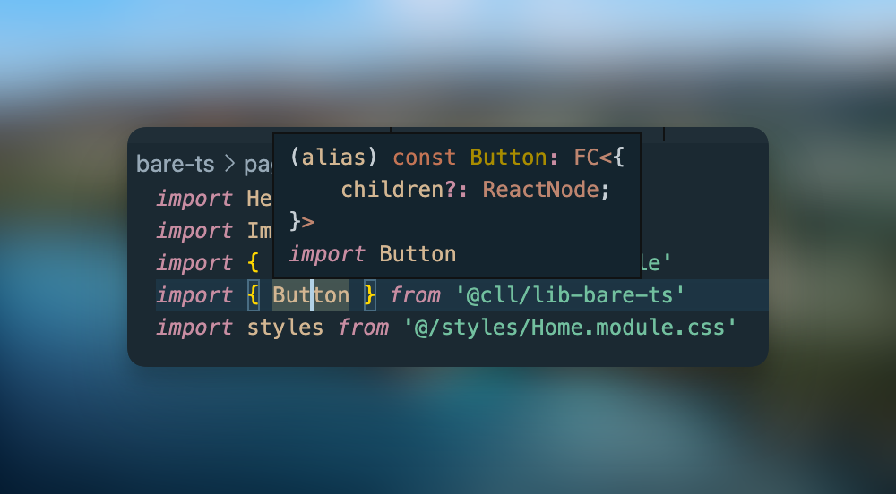

# Component Library Library

The goal of this repo is to showcase different setups that allow you to share React components between repositories.

## Motivation

In most corporate landscapes you have multiple UIs that live in different repositories. In order to avoid duplication and improve consistency, common components such as buttons and dialogs should be shared across those repositories.

## Setup

In order to not overcomplicate things unnecessarily, each sharing setup will have one library (that houses the components to be shared) and one simple Next.js app (that consumes the shared components).

We will also set up all libraries as [ES Modules](https://nodejs.org/api/esm.html#introduction). All libraries (with exception of the barebones example) will be written in [TypeScript](https://www.typescriptlang.org/). We are going to use [`pnpm`](https://pnpm.io/) as a package manager (but everything will work with `npm` or `yarn` just fine).

## [Level 1: Barebones](./lib/bare/)

> Setup: React

While I would not recommend doing this, you can use React completely without a build step. Doing so results in the absolute most minimal setup possible.

**Create a `package.json`**

First, create a `package.json` file:

```json
{
  "name": "@ccl/lib-bare",
  "main": "./index.js",
  "type": "module"
}
```

*   `name` ([Reference](https://nodejs.org/api/packages.html#name)): This is the name of your library that users will use to import it. Here, one would import a component like this: `import { Button } from '@ccl/lib-bare`.
*   `main` ([Reference](https://nodejs.org/api/packages.html#main)): All things exported from the file referenced here will be available to import. Here, `index.js` needs to contain `export const Button = ...` so that we can do `import { Button } from '@ccl/lib-bare`.
*   `type` ([Reference](https://nodejs.org/api/packages.html#type)): This tells the importing application what type of JavaScript module to expect. We want to build our libraries as ES Modules, so we set it to `"module"`.

**Add `react`**

As we're not going to have a build step for this library, properly setting up React as a dependency doesn't really matter and will be covered in a later setup. For now, we'll just do `pnpm add react`.

**Create a component**

Normally, you would create a React component like this:

```jsx
export const Button = () => (
  <button style={{ backgroundColor: 'steelblue' }}>
    {children}
  </button>
)
```

For this to work we would need a build step - JSX syntax is not vanilla JavaScript. Instead, our component will look like this:

```js
import { createElement } from 'react'

export const Button = ({ children }) => createElement('button', {
  style: { backgroundColor: 'steelblue' }
}, children)
```

For more information on the `createElement` method feel free to head over to the [React docs](https://react.dev/reference/react/createElement).

**Publish it**

This repo uses a PNPM workspace setup, so we don't need to publish the packages here. Outside of a monorepo, you would use [npm publish](https://docs.npmjs.com/cli/commands/npm-publish) or some wrapper around it (like [np](https://github.com/sindresorhus/np)) for this.

**Consume it**

Within an app, you can now use the button component by importing it like this:

```js
import { Button } from '@cll/lib-bare'
```


<figcaption>Our ugly button within our demo app!</figcaption>

## [Level 2: Barebones TypeScript](./lib/bare-ts/)

> Setup: React, TypeScript

Nobody wants to write React without JSX. As we're going to need a build step anyway and there's no sane reason to build something without TypeScript nowadays, we're going to go directly to JSX + TypeScript.

Starting from the Level 1 code, we

- move the `index.js` to `src/index.tsx` (to better separate code and build artefact later), and
- add `typescript` and React's types to our `devDependencies` (see the [Appendix](#dependency-types) for an overview over the different dependency types): `pnpm add -D typescript @types/react`.

Once we set up a build step, the built library will be exposed in `dist/index.js`, so we update the `package.json` accordingly:

```json
{
  "main": "dist/index.js"
}
```

**Setting up TypeScript**

In order to compile TypeScript + JSX to vanilla JavaScript, we will add a `build` script to our `package.json` that runs the TypeScript compiler (we will use fancier tooling like `esbuild` in the future):

```json
{
  "scripts": {
    "build": "tsc"
  }
}
```

By default, the TypeScript compiler doesn't really know what to do with your stuff, so you need to create a `tsconfig.json`:

```json
{
  "include": ["src"],
  "compilerOptions": {
    "target": "ESNext",
    "moduleResolution": "nodenext",
    "outDir": "dist",
    "jsx": "react-jsx"
  }
}
```

- `include` ([Reference](https://www.typescriptlang.org/tsconfig#include)): This tells TypeScript which files to look at.
- `compilerOptions.target` ([Reference](https://www.typescriptlang.org/tsconfig#target)): This tells TypeScript which version of ECMAScript (aka which JavaScript standard) to compile to. When developing apps, this should be set to something sensible like `ES6`. For libraries like here, we want the consuming application to have full control over its own bundling and polyfilling, so we use the most up-to-date standard, which is exposed as `ESNext`.
- `compilerOptions.moduleResolution` ([Reference](https://www.typescriptlang.org/tsconfig#moduleResolution)): There's three choices here, `classic`, `node` and `nodenext` (aka `node16`). You probably never want to use `classic` in modern projects. `node` references Node's CommonJS resolution algorithm. Since we want to emit an ES Module, we will use `nodenext`, Node's ES Modules resolution algorithm.
- `compilerOptions.outDir` ([Reference](https://www.typescriptlang.org/tsconfig#outDir)): This tells TypeScript where to put the compiled files. We want them in `dist` (don't forget to add that directory to your `.gitignore`!)  
- `compilerOptions.jsx` ([Reference](https://www.typescriptlang.org/tsconfig#jsx)): This informs the TypeScript compiler that we will use JSX syntax. TypeScript can convert that either to `createElement` calls through `react` (which we used in Level 1) or newer `_jsx` calls available since React 17 through `react-jsx` (see [this blog post](https://legacy.reactjs.org/blog/2020/09/22/introducing-the-new-jsx-transform.html#whats-different-in-the-new-transform)). We want the modern stuff and will use `react-jsx`.

The library can now be published and consumed analogous to the library from Level 1. However, VSCode won't be happy with us, as we did not expose any declaration file (the file telling TypeScript which vanilla JS thing has which type, see [reference](https://www.typescriptlang.org/docs/handbook/2/type-declarations.html)). In order to do that, we extend our `tsconfig.json`:

```json
{
  "compilerOptions": {
    "declaration": true
  }
}
```

Once we run `pnpm build` for our library once more (and publish it if necessary), VSCode understands the type of our imported button:



## Appendix

### Dependency Types

There are three types of dependencies - normal dependencies, development dependencies and peer dependencies. Often it doesn't make that much of a difference what you put where. Also, there are quite a few differences in dependency management between developing an application and developing a library. Here's my mental model:

|                    | Application | Library |
| ------------------ | ------------- | ------------- |
| `dependencies`     | Dependencies that are referenced within code that will be included in the bundle (e.g. component libraries, `react-query`) | =, with the exceptions (see below) |
| `devDependencies`  | Dependencies needed to build the bundle (e.g. types, build tooling) | =, plus dependencies you want to be bundled in your library bundle (ideally none) |
| `peerDependencies` | None | Dependencies without which your library is useless within the application context (usually this is only `react`) |
